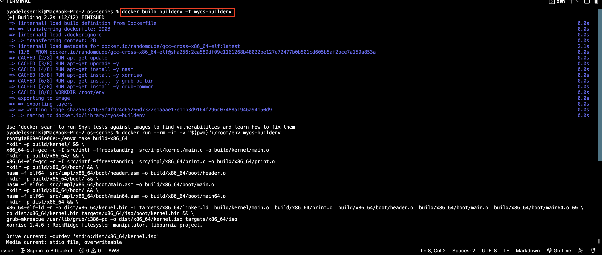
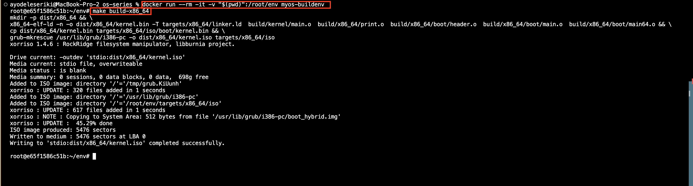
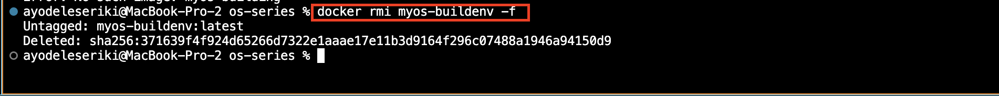

# Operating System

## Prerequisites

 - A text editor such as [VS Code](https://code.visualstudio.com/).
 - [Docker](https://www.docker.com/) for creating our build-environment.
 - [Qemu](https://www.qemu.org/) for emulating our operating system.
 - Remember to add Qemu to the path so that you can access it from your command-line. 

## SETUP
Build an image for our build environment: `docker build buildenv -t myos-buildenv`

## BUILD
First thing is to enter the environment of the build:
For Linux or MacOS run: `docker run --rm -it -v "$(pwd)":/root/env myos-buildenv`
NOTE: If I don't make sure that my docker daemon has access to the drive my development environment is in, I'll have trouble with the unshared drive. For Docker Desktop, this can be found in "Settings > Shared Drives" or "Settings > Resources > File Sharing."

The Build for x86:`make build-x86_64`

We have to close it before running this command to prevent errors.
To leave the built environment, enter the exit.

## EMULATE
The operating system will be emulated using Qemu

Run the following command `qemu-system-x86_64 -Cdrom dist/x86_64/kernel.iso.`

Note: I had to close the emulator when I finished so as to not block writing to the kernel.iso for builds in the future. If the above command doesn't work fails, try one of the following for Windows or Linux:

For windows: `qemu-system-x86_64 -Cdrom dist/x86_64/kernel.iso -L "C:\Program Files\qemu`
For Linux: `qemu-system-x86_64 -Cdrom dist/x86_64/kernel.iso -L /usr/share/qemu/`

Alternatively, we can install a custom BIOS binary file and link it to Qemu using the -L flag option. 
Alternatively, I can load the operating system on a USB drive and boot into it when I turn on my computer. I have had this tested out, and it appears to be working.

## CLEANUP
Remove the build-environment image:
`docker rmi myos-buildenv -f`
